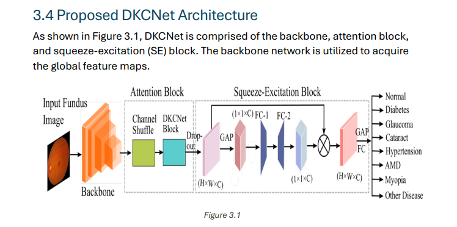

# Chapter 3: Fundus  Classification

## Classification Architecture  

## Channel Shuffle in CNNs
Channel shuffle rearranges the channels of a feature map to enhance information flow across different groups in group convolution. It ensures a balance between computational efficiency and effective feature representation. 

### Steps in ShuffleNet Implementation:
1. **Group Convolution**: Channels are divided into groups, and convolutions are performed within each group.
2. **Channel Shuffle**: Channels from different groups are mixed to enable cross-group communication.
3. **Reshape and Convolve**: Shuffled channels are reshaped and passed to the next convolution layer.

### Key Concepts:
- Channel shuffle is used to maintain learning capacity and improve feature interactions between groups.
- This process enhances the efficiency of group convolutions by promoting information exchange.

---

## DKCNet Block
The DKCNet Block applies dilated convolutions with varying kernel sizes to capture multi-scale features, utilizing larger receptive fields for richer semantic information. This method improves the feature representation while minimizing computational overhead.

### Steps in the DKCNet Block:
1. **Dilated Convolution**: Uses a 2x2 kernel with dilation rates ranging from 1 to 3.
2. **Batch Normalization and ReLU Activation**: Each dilated convolution is followed by batch normalization and ReLU activation.
3. **Global Pooling and Feature Reduction**: Spatial information is squeezed using global pooling operations, followed by channel dimension reduction via fully connected layers.
4. **Attention Map**: A final attention map is generated by element-wise multiplication and addition operations.

---

## Squeeze-and-Excitation (SE) Block
The SE Block recalibrates channel-wise feature responses by modeling channel interdependencies. This mechanism emphasizes important features and suppresses irrelevant ones, enhancing the representational capacity of the network.

### Key Concepts:
- **Squeeze Operation**: Compresses spatial dimensions using global average pooling to generate a channel descriptor.
- **Excitation Operation**: Uses two fully connected layers to process the channel descriptor and produce channel-wise weights.
- **Recalibration**: The original feature map is scaled using these weights, emphasizing important features.

### Benefits of SE Networks:
1. **Enhanced Feature Representation**: Improves focus on informative features.
2. **Improved Performance**: Shows significant improvements in tasks like image classification and object detection.
3. **Lightweight and Efficient**: Minimal computational overhead with versatile integration into existing architectures.

---

## Loss Function
For multi-class, multi-label classification, **Binary CrossEntropy (BCE)** is used to compute the difference between predicted and actual labels.

### BCE Formula:
\[
BCE(y, \hat{y}) = -\frac{1}{M} \sum_{i=1}^{M} [y_i \log(\hat{y_i}) + (1 - y_i) \log(1 - \hat{y_i})]
\]
Where:
- \( M \) is the number of samples.
- \( y \) is the actual label.
- \( \hat{y} \) is the predicted label.

