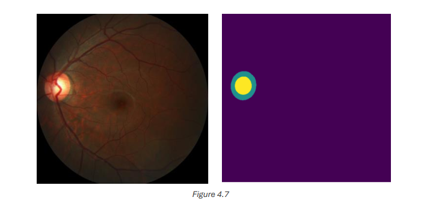

# Chapter 4: Fundus Image Segmentation

## 4.1 Preprocessing of Full Image Segmentation

The preprocessing steps for full images include:

1. **Loading Images and Masks**: Images and masks are loaded and split into training, testing, and validation sets.
2. **Downsampling**: Both images and masks are downsampled to 512x512 pixels.
3. **Numpy Arrays**: Images and masks are converted to arrays of `uint8` type.

Comparison of before and after preprocessing is illustrated in Figures 4.12-4.16.

## 4.2 Data Splitting and Data Augmentation

Data splitting and augmentation are essential for building robust models that generalize well to unseen data.

### 4.2.1 Vessel Segmentation

- **Data Splitting**: The FIVES dataset initially contains 600 training and 200 test images. The dataset was split as follows:
  - Training: 480 images
  - Validation: 120 images
  - Test: 200 images

- **Data Augmentation**: Applied using the **Albumentations** library to enhance the training dataset. The augmentation pipeline includes:
  - Horizontal Flip (100% probability)
  - Random Brightness and Contrast Adjustment
  - Random Gamma Correction
  - Coarse Dropout

This increased the training dataset to 2400 images and masks.

### 4.2.2 OD and OC Segmentation

- **Data Splitting**: The REFUGE dataset was pre-split into 400 training, validation, and test images.
- **Data Augmentation**: Not applied due to memory limitations on Kaggle.

## 4.3 Model Architecture and Training

Two models were implemented for retinal vessel and optic disc/cup segmentation:

1. **U-Net**: Constructed from scratch as explained in section 2.1.
2. **U-Net with Transfer Learning**: Utilized pre-trained backbones from the **Segmentation Models** library (e.g., ResNet, VGG, EfficientNet). These backbones, trained on large datasets like ImageNet, enhanced the U-Net architecture by fine-tuning on the retinal images.

### Hyperparameters for Training the U-Net Model

| Hyperparameter    | Configuration         |
|-------------------|-----------------------|
| **Loss Function**  | Categorical Cross Entropy |
| **Metrics**        | Binary IoU            |
| **Batch Size**     | 8                     |
| **Epochs**         | 100 (Early stopping after 20 epochs of no improvement) |
| **Optimizer**      | Adam (Learning rate = 0.001) |
| **DisplayCallback**| Monitors model predictions every 6 epochs |

## 4.4 Results and Model Evaluation

To evaluate the models, several metrics were used:

- **Precision**: Proportion of true positives among all positive predictions.
- **Recall**: Proportion of true positives among all actual positives.
- **F1-Score**: Harmonic mean of precision and recall.
- **Specificity**: Proportion of true negatives among all actual negatives.
- **Accuracy**: Overall proportion of correct predictions.

