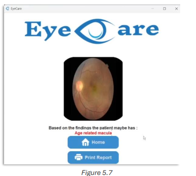

# Chapter 5: Graphical User Interface (GUI) in EyeCare

## 5.3.3 Image Processing Tools in EyeCare

### Pillow
- **Image Processing**: Used for resizing and cropping images, preparing them for analysis within the EyeCare system.
- **Image Display**: Dynamically loads and displays medical images in the GUI, enhancing user interaction and decision-making.

### OpenCV
- **Image Analysis**: Utilized for more complex image processing tasks.
- **Real-time Processing**: Supports real-time image processing, crucial for fast clinical decision-making.

### Integration in EyeCare
- **Python-Based**: The GUI integrates image analysis and deep learning models via Python, offering a simple yet powerful interface.
- **User Interface**: Despite the complex backend, the interface remains user-friendly and accessible to healthcare professionals.

---

## 5.4 Main Window Design

### 5.4.1 Layout and Structure
- **Centralized Dashboard**: Displays primary functions—Classification, Optic Disk Segmentation, and Vessel Segmentation—ensuring easy access.
- **Theme Options**: Supports light and dark modes for improved visual comfort in various work environments.
- **Drag-and-Drop Area**: Simplifies image uploading by allowing users to drag and drop files for analysis.
- **Real-Time Feedback**: Includes interactive feedback mechanisms (e.g., progress bars) to keep users informed about ongoing processes.

---

## 5.5 Image Upload and Handling

### 5.5.1 Drag-and-Drop Interface
- **User-Friendly**: Allows users to easily drag and drop images for uploading, speeding up the workflow in clinical settings.
- **Visual Cues**: Includes clear graphical prompts (e.g., "Drag & Drop or Click to Browse") to guide users.

### 5.5.2 Traditional File Browsing
- **Browse Files Button**: Offers a standard file dialog for users who prefer traditional file browsing to select images.

### 5.5.3 Image Handling and Processing
- **Validation**: After upload, the application checks for supported formats (e.g., JPEG, PNG, TIFF) and image quality.
- **Preprocessing**: Images are resized or enhanced using tools like OpenCV and Pillow before being analyzed.
- **Image Display**: Uploaded and preprocessed images are displayed in the GUI for user verification.

---

## 5.6 Results Display

### 5.6.1 Classification Results
- **List Format**: Disease classification results are shown alongside the original image. Each entry includes potential diagnoses and recommendations.

### 5.6.2 Segmentation Results
- **Overlay Display**: Segmentation results are superimposed on the original image, allowing users to visually compare raw and processed data.

### 5.6.3 Printing and Sharing
- **Print Option**: Users can print results directly from the application for medical records or sharing with other professionals.
- **Save Option**: Results can be saved in various formats, allowing easy integration with electronic health records (EHRs).
